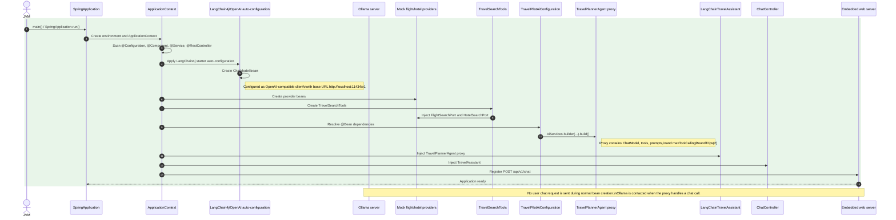
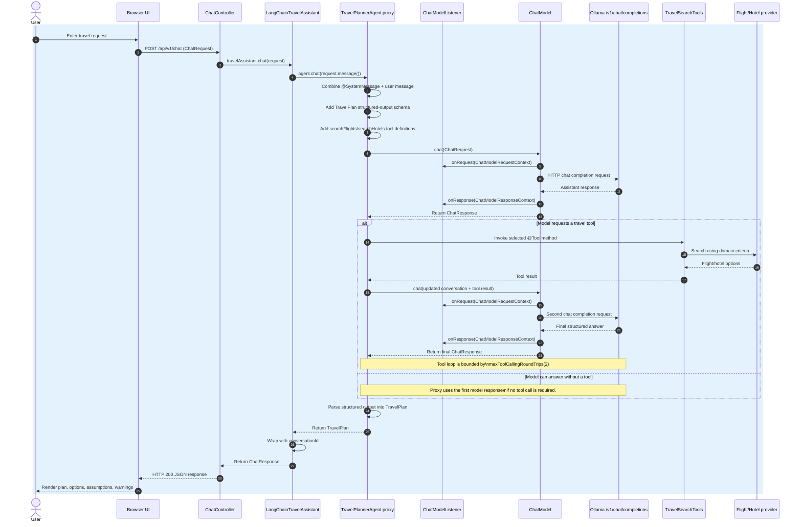

# TravelPilot learning path

This file is the working study plan for the TravelPilot project. Use it with the source code and Git history to decide the next learning milestone.

## Current position

- Days 1–2: Spring Boot, REST, Java 21, provider ports, and PostgreSQL Docker Compose configuration are implemented. Application-image packaging and health checks remain to be added.
- Day 3: AI Service and structured `TravelPlan` response are implemented in the current milestone.
- Day 4: flight and hotel `@Tool` methods with deterministic mock providers are implemented and verified through the UI.
- Next milestone: Days 5–6 — RAG/vector search.
- Remaining verification: run the Maven test suite locally after dependencies are available.

## Suggested 15-day learning path

| Days | Topic | Deliverable |
|---|---|---|
| 1–2 | Spring Boot, Docker, configuration | Running API with health checks and provider abstraction |
| 3 | LangChain4j fundamentals | Chat model, AI Service, prompts, structured output |
| 4 | Tools/function calling | `@Tool` methods for flight and hotel search |
| 5–6 | RAG/vector search | Policy and destination knowledge base with citations |
| 7 | Memory | Chat memory, user preferences, and task state |
| 8 | MCP | Build an MCP server for travel tools and consume it from the app |
| 9–10 | LangGraph4j | Stateful workflow with retries, branching, and bounded loops |
| 11 | Multi-agent design | Search agent, policy agent, itinerary agent, critic |
| 12 | gRPC | Separate mock availability service exposed over gRPC |
| 13 | Testing and evaluation | JUnit tests, golden dataset, tool-call tests, LLM-as-judge |
| 14 | Observability and security | OpenTelemetry traces, cost/latency metrics, prompt-injection tests |
| 15 | Demo and interview preparation | Architecture diagram, ADRs, README, Docker demo |

## Milestone rule

For each milestone, add the implementation, at least one focused test, and a short README or ADR explaining the design decision. Do not move to the next topic until the current feature can be demonstrated through the API or UI.

## End-to-end startup and request sequence

The application has two distinct lifecycles:

1. **Startup:** Spring creates and wires the reusable objects. This is where the
   `ChatModel`, tools, providers, LangChain4j proxy, service, and controller are
   initialized. Startup does not normally send a user prompt to Ollama.
2. **Request handling:** Each `POST /api/v1/chat` request travels through the
   controller, service, LangChain4j proxy, model, and—when requested by the
   model—travel search tools. The proxy then converts the final model output
   into `TravelPlan`.

The diagrams use green for startup and blue for request-time execution.

### Startup: dependency initialization and wiring

### Request: from the UI to the final `TravelPlan`

The request sequence is the runtime view of the detailed explanation above
`agent.chat(...)` in
[`LangChainTravelAssistant.java`](src/main/java/com/example/travelpilot/application/LangChainTravelAssistant.java).

## Next milestone: RAG/vector search

Build a policy assistant for baggage, cancellation, hotel cancellation, and visa/destination guidance. The response must cite the retrieved source documents and explicitly say when the knowledge base does not contain an answer.
